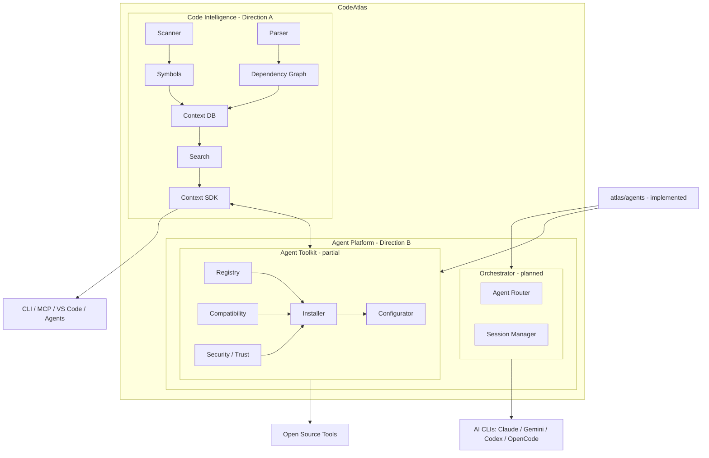

# Agent Toolkit

> **Status: [PARTIAL]** — this document is the **design contract** for a new
> first-class CodeAtlas subsystem. As of Tasks 19–25 the **Tool Registry
> foundation, the Tool Manifest System, the Compatibility Engine, the Tool
> Installer, and the Tool Configurator are implemented** (see [TOOL_REGISTRY.md](./TOOL_REGISTRY.md),
> [TOOL_MANIFEST.md](./TOOL_MANIFEST.md), and [CURRENT_STATE.md](./CURRENT_STATE.md)):
> `@atlas/toolkit` behind `ToolRegistryPort`, `CompatibilityPort`,
> `InstallerPort`, and `ConfiguratorPort` in `core`, composed by the SDK as
> `createToolRegistry()`, `createCompatibilityEngine()`, `createInstaller()`,
> and `createConfigurator()`.
> **Security/Trust evaluation is implemented [IMPLEMENTED]**. The Tool Configurator and
> The `atlas tools` CLI surface is implemented for Task 25. The Toolkit also builds on `@atlas/agents`
> (the AI CLI connection layer, `AgentPort`) — see
> [CURRENT_STATE.md](./CURRENT_STATE.md) and [MODULES.md](./MODULES.md).

---

## 1. Purpose

CodeAtlas is an **AI Context Engine** (Direction A, implemented) and a
**Unified AI CLI Orchestrator** (Direction B, planned). The **Agent Toolkit**
adds a third, complementary capability: a single trusted interface for
**discovering, installing, configuring, managing, and verifying high-quality
open-source developer / AI-agent tools**.

Today a user must manually research GitHub, npm, PyPI, MCP directories, CLI
tools, and AI-agent utilities to assemble their agent toolchain. The Toolkit
gives them one curated place to do that:

```
CodeAtlas
    ↓
Agent Toolkit
    ↓
Curated Open Source Tools
    ├── Context tools
    ├── Token optimization
    ├── AI quality tools
    ├── Agent tools
    ├── MCP servers
    ├── CLI utilities
    ├── Code analysis
    └── Developer productivity
```

### What it is NOT

- **Not a random package installer.** The Toolkit never does
  `download random repo → execute install.sh → done`.
- **Not a fork or bundle.** CodeAtlas does **not** copy third-party projects
  into its repository. It references and installs them through their **official
  distribution mechanisms**, respecting licenses, copyright, attribution,
  security, and package ownership (see [§7 Security](#7-security-model) and
  [§8 Trust](#8-trust-model)).
- **Not a marketplace.** It is a curated, verified layer that sits *above*
  package ecosystems and recommends from an authoritative registry.

> **Guiding principle (same as the orchestrator):** CodeAtlas **orchestrates**
> and is the **intelligence layer**; it does not reimplement the internals of
> the tools it manages.

---

## 2. Architecture

The Toolkit composes through the SDK (like every other consumer) and reuses
`@atlas/agents` for AI-CLI detection.



> `@atlas/agents` (the narrow spawn/detect boundary behind `AgentPort`) is
> implemented. The Configurator is wired through the SDK and depends on the
> `AgentPort` seam (and the existing adapters)
> for AI-CLI detection — it must **not** duplicate executable detection or
> provider-specific launch arguments.

### Where the Toolkit lives

Consistent with [DEPENDENCIES.md](./DEPENDENCIES.md) (the package and toolkit
ports exist; Security/Trust is implemented):

- A new feature package `@atlas/toolkit` (imports **only** `core` + `shared`),
  hosting the Registry, Tool Manifest, Compatibility, Installer, and
  Configurator and Security/Trust behind ports in `core` (**implemented**).
- A thin Toolkit **CLI surface** (`atlas tools ...`) added in `apps/cli`,
  which delegates to the SDK — never to feature packages directly.
- SDK wiring (`@atlas/sdk`) composes the Toolkit behind its ports, exactly as
  it composes every other feature package today.
- `@atlas/agents` already exists behind `AgentPort` in `core`; the Toolkit
  depends on that **port**, not on the concrete `AgentService`.

### Dependency direction (planned, enforced by ESLint)

```
cli → sdk → toolkit + agents → core → shared
```

The Toolkit must **not** reach for `@atlas/scanner`, `@atlas/storage`, etc.
directly; anything it needs from CodeAtlas context comes through the
**Context SDK** or the port seams.

---

## 3. Tool Registry

**Owner:** `@atlas/toolkit` — **[IMPLEMENTED]** (Task 19, registry foundation;
see [TOOL_REGISTRY.md](./TOOL_REGISTRY.md)). The sections below remain the
design contract for how the registry feeds later tasks.

The Registry is the **authoritative catalog of what exists** — the *"what is
there"* layer. It is deliberately **separate from the Recommendation Engine**
(§11), which answers *"what is useful for this user/project."*

### Responsibilities

- Curate tool metadata: name, description, categories, versions, licenses,
  repositories, websites, maintainers.
- Record installation methods (npm / pip / cargo / go / binary / GitHub
  release / MCP package).
- Record compatibility requirements (OS, runtime, package manager, AI CLI
  availability/version, MCP compatibility, architecture, permissions).
- Record configuration requirements and supported agents.
- Record security status and trust level (see §7, §8).
- Track last-update / maintenance signals. **Stars are not the quality
  signal** — they are one weak input among many.
- Keep categories **extensible**; nothing is hardcoded around the initial
  category list.

### Registry sources (planned)

The CodeAtlas registry is the **authoritative layer**. External sources are
advisory inputs that must pass the curated/sanitized pipeline before they can
be recommended:

```
Curated CodeAtlas registry  ← authoritative
GitHub / npm / PyPI / Cargo / MCP ecosystem  ← inputs, never trusted directly
```

Do **not** automatically trust arbitrary external metadata. External metadata
is enriched, reconciled, and then *curated*; it is never auto-approved.

### Data model (conceptual, not final)

```yaml
name: example-tool
description: Tool description
repository: https://github.com/org/example-tool
website: https://example-tool.dev
license: MIT
version: 1.2.3
stars: 1234            # weak signal only, not a trust basis
lastUpdate: 2026-07-01
maintainer: example-org
categories:
  - token-optimization
install:
  type: npm            # npm | pip | cargo | go | binary | github-release | mcp
  package: example-tool
supports:
  - claude
  - gemini
  - codex
  - opencode
compatibility:
  os: [win32, linux, darwin]
  runtimes: [{ name: node, ">=": "20.19.0" }]
  agents: [claude, gemini]
configuration:
  type: automatic      # automatic | manual | none
security:
  status: reviewed     # verified | reviewed | community | unverified | blocked
  lastReview: 2026-07-01
benchmarks:            # future; vendor claims vs CodeAtlas benchmarks, see §12
  - metric: tokens
    source: vendor-claim
```

> The exact schema is **not** final — this is a starting point to be refined
> during implementation (Task 19/20). Do not treat the YAML above as
> committed.

---

## 4. Tool Manifest

**Owner:** `@atlas/toolkit` — **[IMPLEMENTED]** (Task 20). See
[TOOL_MANIFEST.md](./TOOL_MANIFEST.md) for the schema, storage, and validation
details.

A **Tool Manifest** describes *one installed tool* on the user's machine —
separate from the Registry entry. It records:

- which tool + version is installed,
- **where** it was installed from (registry entry, npm package, release asset),
- the **install method** and provenance,
- the **verification result** (checksum / signature / build from source),
- the **applied configuration** and which agents it was configured for,
- the trust + security status that applied at install time,
- a `doctor`-able integration state (see §9).

This mirrors the codebase's existing **Manifest pattern** (`@atlas/scanner`
`manifest.ts`) — installed-tool state lives next to the project state in
`.codeatlas/`, so `atlas tools doctor` can reconcile what is expected vs. what
is actually present.

---

## 5. Tool Installer

**Owner:** `@atlas/toolkit` — **[IMPLEMENTED]** (Task 22) with a safe MVP subset.

> **Implemented (Task 22):** `InstallerPort` in `core` + `InstallerService` in
> `@atlas/toolkit`, composed via `createInstaller()` in `@atlas/sdk`. Adapters
> ship for the **safe MVP subset** (`npm`, `pip`, `cargo`, `go`); `binary`,
> `github-release`, and `mcp` are declared by the port but not yet executable —
> adding one is a **new small adapter**, never a fork. Every command is an
> argument-array spawn (`shell:false`), approval is mandatory, `blocked` tools
> fail closed, verification reports `verified`/`unverified`/`failed` honestly,
> and a Tool Manifest (Task 20) records provenance with best-effort rollback.
> See [CURRENT_STATE.md](./CURRENT_STATE.md) and the
> `packages/toolkit/tests/installer-*.test.ts` suite (incl. adversarial tests).

The Installer enforces the product decision from the brief: **automatic
installation is opt-in; the user stays in control.**

```
Validate tool
    ↓
Check compatibility   (see §6)
    ↓
Check security metadata (see §7)
    ↓
Ask user approval
    ↓
Install
    ↓
Configure (see §9)
    ↓
Verify
```

### Install types (design the abstraction, implement incrementally)

- `npm` / `pip` / `cargo` / `go` — the ecosystem's package manager,
  installing the **official package**, never a tarball from a random URL.
- `binary` — official release asset, with checksum verification.
- `github-release` — official release artifact with checksum/signature checks.
- `mcp` — an MCP server package (npm/pip) installed as a tool that CodeAtlas
  can register for an agent.

**Do not implement all installers now.** The MVP ships a safe subset (see
[ROADMAP.md](./ROADMAP.md) Phase 6). The abstraction is an
**`InstallerPort`** with one adapter per install type, mirroring the existing
`ProviderPort` / `AgentPort` adapter pattern — so a new ecosystem is a new
small adapter, not a fork.

### Security-critical rules (non-negotiable, see [SECURITY.md](./SECURITY.md))

- Install through **official distribution channels only**.
- **Never** execute arbitrary install scripts downloaded from a repository.
- Verify **checksums/signatures** for binary and release installs.
- Pass package-manager arguments as **argument arrays**, never shell strings.
- Record **provenance** in the Tool Manifest.
- Any network access is explicit and user-approved; no implicit uploads
  ([PRIVACY.md](./PRIVACY.md)).

---

## 6. Compatibility Engine

**Owner:** `@atlas/toolkit` — **[IMPLEMENTED]** (Task 21).

Before installing, the Toolkit determines whether the tool **can run in this
environment at all**:

```
Operating System
Runtime version (Node, Python, Go, …)
Package manager availability
AI CLI availability + version
MCP compatibility
Architecture (x64 / arm64 …)
Required permissions
```

The Registry schema lets tools **declare** compatibility requirements (see §3).
The Compatibility Engine evaluates them against the **detected environment**,
using `@atlas/agents` (`AgentPort`) for AI-CLI availability and version.

Implemented pieces (`packages/toolkit`): `CompatibilityEngineService` behind
`CompatibilityPort` in `core`; `EnvironmentDetector` (read-only, offline,
injectable OS/arch/Node-version/binary resolver); a minimal documented semver
range matcher (`version-range.ts` — `*`, exact, `> >= < <= =`, `^`/`~`, AND
groups, `||` OR; everything else fails closed); and `renderCompatibilityReport`
(`✓ / ~ / ✗ / ?` per check, sub-checks indented, then the overall verdict).
Composed by the SDK as `createCompatibilityEngine()`.

Example output:

```text
Tool: Token Tool (v1.4.2)
✓ OS — running on win32
✓ Node >=20.19.0 — found node (v22.14.0)
✓ AI agents
  ✓ claude — found claude v2.0.1
  ✗ gemini — AI CLI 'gemini' not found on PATH
✓ Architecture — running on x64
? Python >=3.12 — found python3 (banana) but its version could not be parsed
OVERALL: partially-compatible
```

A tool that fails compatibility is surfaced as **not installable in this
environment** (`OVERALL: incompatible — not installable in this environment`)
— it is not auto-installed and not silently skipped.

---

## 7. Security Model

**Status: implemented (Task 24).** CodeAtlas must **never** blindly execute arbitrary
installation scripts from GitHub.

### Security inputs

Before any install, consider:

- Repository (owner, stars, activity, fork status)
- License
- Release / version / tag
- Package source (official registry vs. unknown tarball)
- Dependencies (transitive supply chain)
- Install commands (what would actually run)
- Required permissions (network, filesystem, processes)
- Secrets (does the install ask for / expose keys?)
- Maintenance status (last commit, open issues, bus factor)

### Security status

Every registry entry carries one of:

| Status      | Meaning |
| ----------- | ------- |
| `verified`  | Reviewed by CodeAtlas against a concrete checklist (rare; high bar) |
| `reviewed`  | Passed a documented review pass (metadata + install path + provenance) |
| `community` | Community-used and reported, but not individually audited by CodeAtlas |
| `unverified`| Not yet reviewed; installable only with explicit user override |
| `blocked`   | Known bad — cannot be installed through the Toolkit |

**Do not claim CodeAtlas has audited a tool unless it actually has.** The
default is `unverified`; promotion to `reviewed`/`verified` is a deliberate,
documented, human-in-the-loop act.

---

## 8. Trust Model

A user-facing **trust hierarchy** so a user understands, *before* installing,
where a tool sits:

```
Verified
        ↓
Reviewed
        ↓
Community
        ↓
Unverified
        ↓
Blocked
```

- **Verified** — CodeAtlas completed a documented high-bar checklist; this is
  rare and never inferred from popularity or an official registry.
- **Reviewed** — passed a CodeAtlas review pass.
- **Community** — used in the wild, not individually audited here.
- **Unverified** — not yet reviewed; requires explicit user opt-in.
- **Blocked** — disallowed (malware, abuse, broken provenance).

The exact trust states are `verified`, `reviewed`, `community`, `unverified`,
and `blocked`; `official` is a distribution/source concept, not a trust state.
The SecurityAssessor records the state in the install plan and Tool Manifest.
`unverified` requires explicit consent; `blocked` is a hard gate. The broader
list/install CLI rendering remains planned, while the SDK/installer surfaces
the assessment and records an override in the bounded install log.

---

## 9. Tool Configurator

**Owner:** `@atlas/toolkit` (**implemented**, Task 23).

A major purpose of the Toolkit is **automatic configuration**: after install,
the tool is wired into the agents/environment that can use it.

```
Tool installed
    ↓
Detect supported agents   (via AgentPort / @atlas/agents)
    ↓
Generate configuration
    ↓
Apply configuration
    ↓
Verify integration
```

### Provider-specific configuration = adapters

Provider/target-specific logic **must** live in small **adapters**, exactly
like `@atlas/providers` and `@atlas/agents`. There is **one** config adapter
per target (Claude / Gemini / Codex / OpenCode / MCP / VS Code). **No giant
`if (target === …)` configuration function.**

```
ConfiguratorPort
   ├── ClaudeAdapter      → writes Claude settings / MCP registration
   ├── GeminiAdapter      → writes Gemini settings
   ├── CodexAdapter       → writes Codex settings
   ├── OpenCodeAdapter    → writes OpenCode settings
   ├── McpAdapter         → registers MCP servers in the agent config
   └── VsCodeAdapter      → writes VS Code settings / recommends extensions
```

Configuration is written to **user config**, never silently into the analyzed
repository (see [SECURITY.md](./SECURITY.md) — repo files are untrusted input;
keys come from user config).

---

## 10. CLI / Slash-Command UX

### Planned CLI surface (`apps/cli`, delegates to the SDK)

```bash
codeatlas tools                    # overview: recommended + installed
codeatlas tools search <query>     # search the registry
codeatlas tools install <tool>     # install (approval flow)
codeatlas tools remove <tool>      # uninstall + remove config
codeatlas tools update             # update installed tools / registry
codeatlas tools doctor             # reconcile installed vs manifest vs env
```

### Planned slash-command surface

Consistent with the planned orchestrator (`/claude`, `/gemini`, …):

```text
/      → /tools · /context · /search · /claude · /gemini · /codex · /opencode
```

```text
/tools
────────────────────────
Recommended
  Token Optimization
  Context Engine
  Code Review
  MCP Tools

Installed
────────────────────────
  ✓ Tool A
  ✓ Tool B
```

Selecting a tool offers: **View · Install · Configure · Update · Remove ·
Doctor**.

### Planned one-command setup

```bash
codeatlas setup
```

```
Detect environment
  ↓
Detect installed AI CLIs
  ↓
Detect CodeAtlas capabilities
  ↓
Recommend tools
  ↓
User selects tools
  ↓
Install → Configure → Verify
```

**No automatic install without explicit user approval**, unless the user
enables an explicit automation mode. `setup` is a guided flow, never a
blanket installer.

---

## 11. Future: Tool Recommendation Engine

Kept **separate from the Registry** (Registry = *what exists*; Recommendation
Engine = *what is useful for this user/project*). **[PLANNED / future]**.

Inputs:
- repository characteristics,
- agent usage,
- context usage,
- token usage,
- installed tools,
- developer preferences.

Outputs: recommended tools. Example signals:

```text
Your agent repeatedly requests the same files → recommend a context-caching tool
Your agent processes large CLI outputs       → recommend a token-optimization tool
```

These are **future capabilities** — not part of the MVP.

---

## 12. Future: Benchmarking

**One of the strongest differentiators.** **[PLANNED / future]**.

CodeAtlas will eventually measure, per task:

```
Token usage · Context size · Latency · Task success · Error rate
Repeated reads · Tool calls · Agent cost
```

and compare **Without Tool vs With Tool**.

Important rules:

- **Never promise a specific % of token savings.**
- Store **third-party claims separately** from CodeAtlas's own benchmarks:
  `vendor-claim` | `codeatlas-benchmark` | `unverified`.
- Use precise language — **no "eliminates hallucinations."** The Toolkit
  describes capabilities as *hallucination mitigation / verification /
  validation / quality improvement*.

---

## 13. Context + Toolkit integration

The Toolkit composes through the **Context SDK** — it never opens the database
or imports feature packages directly (same rule as `@atlas/mcp`, `atlas
search`, and the VS Code extension). Context signals (repeated reads, large
outputs, high churn) feed the **future** Recommendation Engine — see
[CONTEXT_SDK.md](./CONTEXT_SDK.md).

---

## 14. Boundaries — what this subsystem will NOT do

- **Not** copy third-party code into the CodeAtlas repository.
- **Not** execute arbitrary install scripts / `install.sh` from GitHub.
- **Not** auto-install tools without explicit user approval (opt-in only).
- **Not** build a full marketplace or billing (future, out of MVP).
- **Not** implement automatic recommendation, auto token optimization, or auto
  hallucination detection in the MVP.
- **Not** reimplement the internals of the tools it manages (same principle as
  the orchestrator, ADR-002).

---

## 15. Relationship to the rest of CodeAtlas

| Concern | Owner / seam |
| ------- | ------------ |
| Tool catalog | `@atlas/toolkit` Registry — **implemented** (Task 19) |
| Installed-tool state | Tool Manifest in `.codeatlas/tools/` — **implemented** (Task 20) |
| Compatibility | `@atlas/toolkit` Compatibility Engine — **implemented** (Task 21) |
| Installers | `InstallerPort` + per-ecosystem adapters — **implemented** (Task 22, MVP subset `npm`/`pip`/`cargo`/`go`) |
| Configuration | `ConfiguratorPort` + per-target adapters — **implemented** (Task 23) |
| Security / trust | `SecurityPort` + offline `SecurityAssessor` — **implemented** (Task 24); hard installer gate |
| AI-CLI detection | `@atlas/agents` (`AgentPort`) — **implemented** |
| CLI surface | `atlas tools` overview/search/info/install/remove/update/configure/doctor — **implemented**; the `atlas tui` slash surface adding `/toolkit` (installed + recommended sidebar) and `/tools-install <tool>` (plan → confirm → install) is **v2 / not shipped** (untracked); `atlas setup` and a standalone `/tools` slash command remain planned |
| AI-CLI catalog | the four npm-installable AI CLIs (`claude`, `gemini`, `codex`, `opencode`) ship as curated Registry entries with official npm install methods, so a missing agent can be installed through the same approval-gated installer (via `atlas tools` or the v2 TUI) |
| Recommendation | separate future module (planned) |
| Benchmarking | separate future subsystem (planned) |

See [ROADMAP.md](./ROADMAP.md) Phase 6 (Agent Toolkit) for the task order, and
[SECURITY.md](./SECURITY.md) for the non-negotiable rules this subsystem is
subject to.
